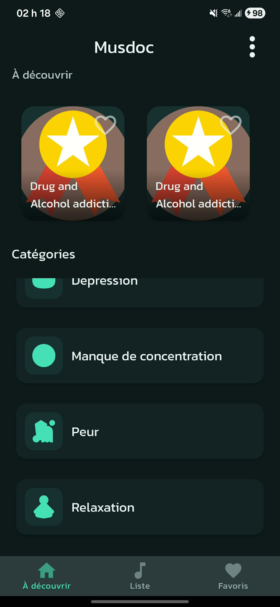
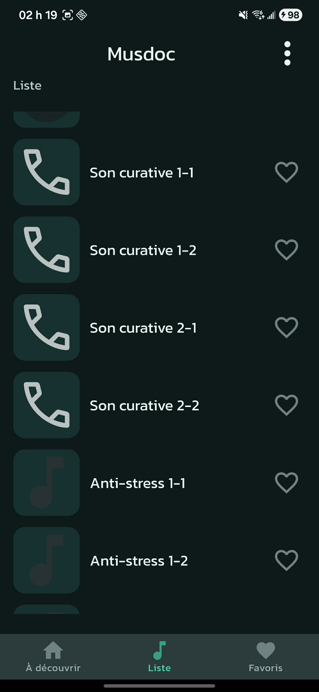
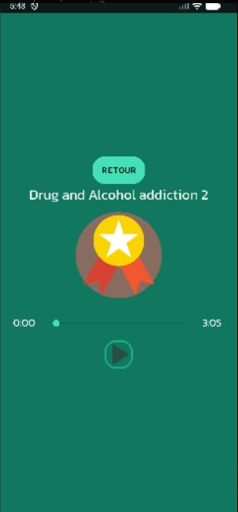
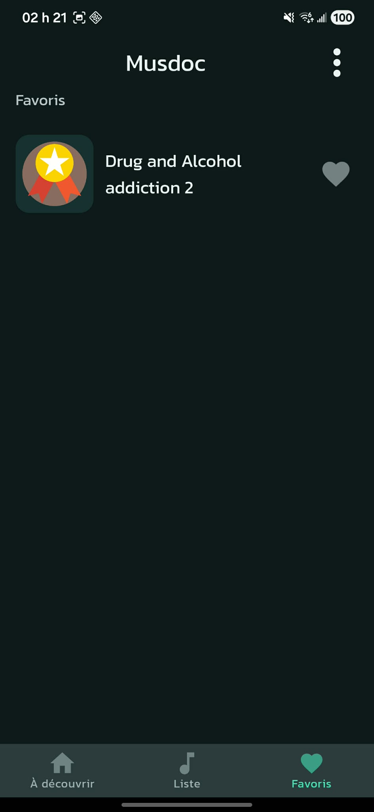

# Musdoc — Android Music Therapy App

Musdoc is a native Android application built with Kotlin that helps users track emotions and listen to curated music playlists to support emotional well-being.

This project demonstrates core Android development concepts including MVVM architecture, local persistence with SQLite, UI navigation, and media playback.

The application APK is available in the **Releases** section of this repository.

---

## Features

- Emotion selection with local persistence (SQLite)
- Music playback using Android MediaPlayer
- ViewModel-based UI state management (MVVM)
- Multi-screen navigation
- Simple and intuitive user interface
- Local user history tracking

---

## Tech Stack

- Kotlin  
- Android SDK  
- SQLite  
- MVVM Architecture  
- ViewModel  
- MediaPlayer API  
- Gradle  

---

## Architecture Overview

The project follows the MVVM (Model–View–ViewModel) pattern:
ui/ – Activities and UI components
viewmodel/ – Business logic and UI state management
data/ – SQLite database access and repositories
model/ – Domain models

This separation improves maintainability, testability, and scalability.

---

## Screenshots

  
  
  
  

---

# Getting Started

### Requirements

- Android Studio
- JDK 11+

### Run Locally

1. Clone the repository
2. Open the project in Android Studio
3. Sync Gradle
4. Run on emulator or physical device

---

## APK Download

A ready-to-install APK is available in the **Releases** section of this repository.

---

## Personal Contribution

This project was fully developed by me, including:

- UI design and navigation
- MVVM implementation
- SQLite persistence
- Music playback integration
- Application logic

---

## Purpose

This application was built as an academic and personal project to strengthen Android development skills, software architecture understanding, and mobile application design.
