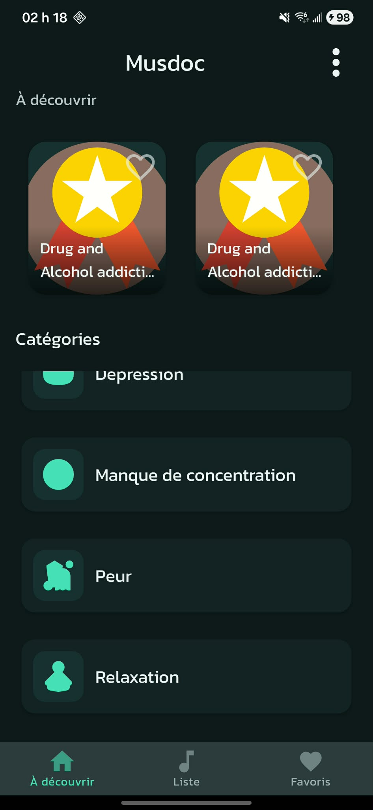
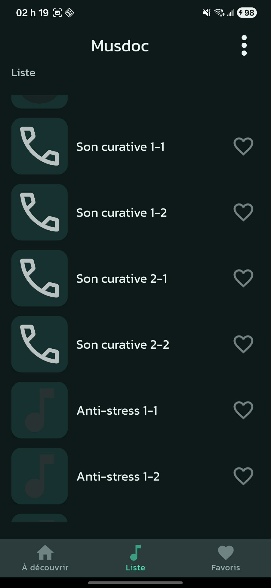
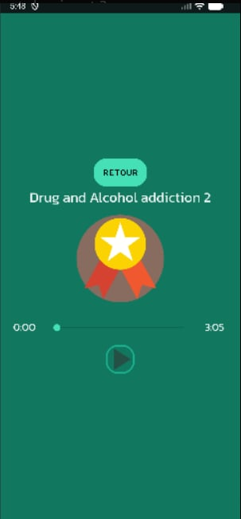
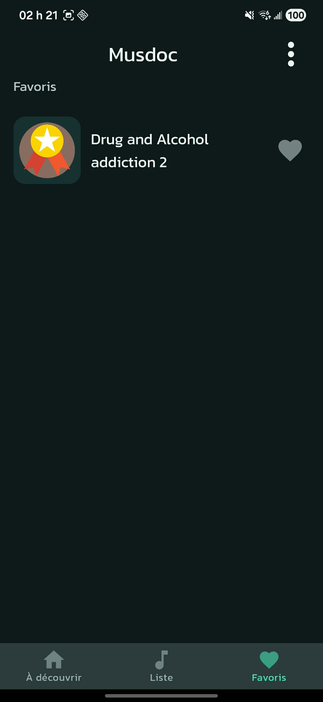

# Musdoc — Android Music Therapy App

Musdoc is a native Android app built with Kotlin to support music therapy sessions.  
It was developed in collaboration with a music therapist, whose professional feedback  
drove a full architectural refactoring from a flat structure to MVVM.

**[⬇ Download APK](https://github.com/Tanjonyavo/Musdoc/releases/latest)**  
Requires Android 8.0 (API 26) or higher.

---

## Screenshots

| Home | Music list | Player | Favourites |
|------|-----------|--------|------------|
|  |  |  |  |

---

## Features

- Emotion-based music selection with local persistence
- Audio playback via Android `MediaPlayer`
- Favourites management with instant toggle
- Full session history stored locally (SQLite)
- Multi-screen navigation with back-stack handling
- ViewModel-driven UI state — no logic in Activities

---

## Architecture

The project follows the **MVVM** pattern with a clear package separation:
```
app/src/main/java/
├── ui/          — Activities and UI components (View layer)
├── viewmodel/   — Business logic and UI state (ViewModel)
├── data/        — SQLite helpers and repositories (Model layer)
└── model/       — Domain entities
```

The ViewModel layer holds all state and survives configuration changes.  
Activities observe LiveData and contain no business logic.

---

## Tech Stack

| Layer | Technology |
|-------|-----------|
| Language | Kotlin |
| Architecture | MVVM |
| Persistence | SQLite (Android `SQLiteOpenHelper`) |
| UI state | ViewModel + LiveData |
| Media | Android `MediaPlayer` API |
| Build | Gradle |

---

## Getting Started

**Requirements:** Android Studio · JDK 11+
```bash
git clone https://github.com/Tanjonyavo/Musdoc.git
```

1. Open the project in Android Studio
2. Sync Gradle
3. Run on an emulator or a physical device (API 26+)

Alternatively, install the APK directly from the [Releases](https://github.com/Tanjonyavo/Musdoc/releases/latest) page.

---

## Licence

[MIT](LICENSE)
```

**Pourquoi :** Supprime les deux sections qui coulaient le projet. Réoriente le pitch sur le vrai différenciateur (feedback musicothérapeute → refactorisation). Ajoute un tableau Tech Stack lisible en 5 secondes. Met le lien de téléchargement immédiatement visible.

---

### Notes de release Musdoc — `v1.0`

**Titre :** `Musdoc v1.0`

**Corps :**
```
## What's included

- Emotion-based music selection
- Audio playback (Android MediaPlayer)
- Favourites with local persistence (SQLite)
- Session history tracking
- MVVM architecture — full ViewModel/LiveData implementation

## Installation

1. Download `Musdoc.apk` below
2. On your Android device: Settings → Security → Allow installation from unknown sources
3. Open the downloaded file and install

**Requires Android 8.0 (API 26) or higher.**
```

**Pourquoi :** "Debug APK for testing purposes" est remplacé par des instructions d'installation claires. Le mot "debug" disparaît. La version s'appelle `v1.0`, pas `v1.0 (debug)`.

---

### Notes de release ChessGame — `v1.0`

**Titre :** `ChessGame v1.0`

**Corps :**
```
## What's included

Full two-player chess engine with:
- Legal move validation for all 6 piece types
- Castling (kingside and queenside)
- En passant capture
- Pawn promotion
- Check, checkmate, and stalemate detection
- Threefold repetition tracking
- Game timer: Blitz / Rapid / Classic modes

## Installation

1. Download `ChessGame.exe` below
2. Run the executable — **Java 11 or higher is required**

> **Note:** Windows SmartScreen may display a warning on first launch because the
> executable is unsigned. Click "More info" → "Run anyway" to proceed.
> This is expected for self-distributed Java applications.

## Running from source
```bash
git clone https://github.com/Tanjonyavo/ChessGame.git
cd ChessGame
mvn package
```
